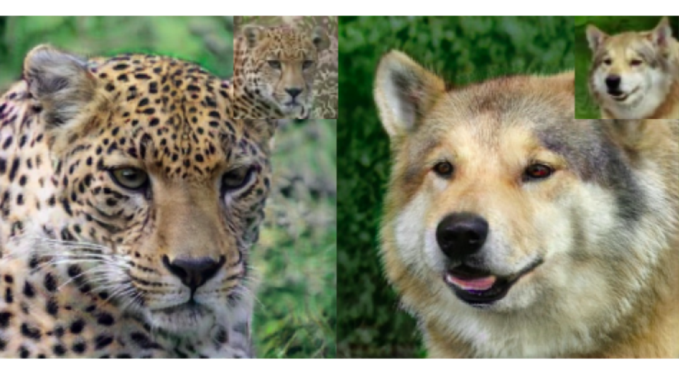
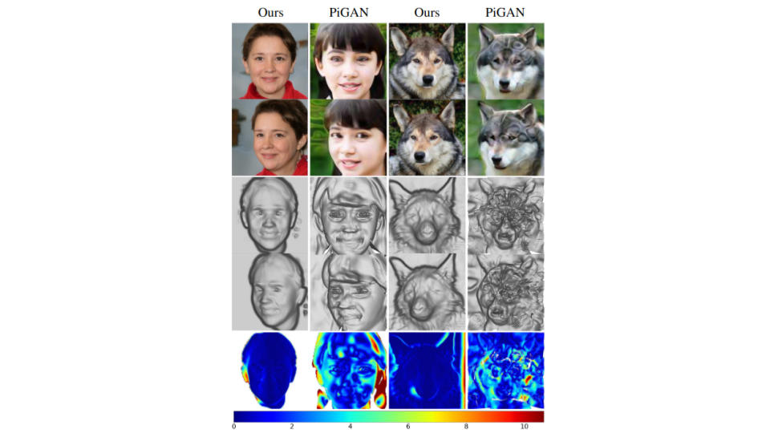

<html>
<h1 align="center">Paper Review on <b>StyleSDF</b></h1>

This Blog article is the review of paper <a href="https://arxiv.org/pdf/2112.11427.pdf" targer="_blank">StyleSDF: High-Resolution 3D-Consistent Image and Geometry Generation</a> published in CVPR 2022 <a href="#1">[1]</a>. First we will look at a brief introduction to the topic, followed by relevant concepts and some related works. Then we will discuss the implementation details in depth, followed by evaluations and results. Finally, we conclude this review by looking at the limitations & future work.

 
 
<h1 class="title" align="center">Introduction</h1>

2D Image Generation, the task of generating new images, is becoming increasingly popular now a days. Extending this generation task to another dimension brings us to the concept of 3D image generation. Techniques such as GRAF <a href="#2">[2]</a>, HoloGAN <a href="#3">[3]</a>, PiGAN <a href="#4">[4]</a> have made a great amount of contribution in this area. Although these techniques have their pros and cons, overall 3D-image generation poses two main challenges, high resolution view-consistent generation of RGB images and detailed 3D shape generation. <b>StyleSDF</b> <a href="#1">[1]</a> attempts to achieve these challenges. StyleSDF is a technique that generates high resolution 3D-consistent RGB images and detailed 3D shapes, with nover views that are globally aligned, while having stylistic awareness that enables image editing. StyleSDF is trained on single-view RGB data only and Fig.01 summarises the goal of StyleSDF in a concise manner.

 

Fig.01 The goal of StyleSDF

 

Fig.02 summarizes how StyleSDF is implemented to achieve it's goals. As we can see that StyleSDF first generates a view-consistent 3D shape, from which it then extracts a 64x64 RGB image and its corresponding feature vector. Later, it combines both the low resolution RGB-image and feature vector to generate a high resolution 1024x1024 RGB-image that is 3D-consistent.

 

Fig.02 High level view of StyleSDF algorithm

 

Before discussing about StyleSDF more detailly, Let us look at some relavant topics and related works that better equip us to understand the technique in a much efficient manner.

 
 
<h1 class="title" align="center">Relevant Topics</h1>

<h2>Signed Distance Field</h2>

Signed Distance Field (SDF) is a 3D Volumetric representation in which each 3D spatial coordinate will have a value, called Distance value (Fig.03). This distance value can be either positive, 0 or negative and the value tells us how farther away spatially are we from the nearest point on the surface. A zero distance value at a particular location indicates that there exists a surface at that spatial point. A positive values indicates the distance away from surface in the direction of surface normal and a negative value indicates the distance away from the surface in the opposite direction of surface normal.

 

Fig.03 Signed Distance Field

 

<h2>Neural Rendering</h2>

The concept of neural rendering combines ideas from classical computer graphics and machine learning to create algorithms for synthesizing images from real-world observations <a href="#5">[5]</a>. Neural rendering is 3D consistent by design and it enables applications such as novel viewpoint synthesis of a captured scene.

 

Fig.04 Neural Rendering

 

<h2>Neural Radiance Field - NeRF</h2>

Neural Radiance Field is a functional representation that jointly models geometry and appearance, and is able to model view-dependent effects <a href="#6">[6]</a>. Fig.05 shows the Radiance field function. The function takes 5D cordinates (3 spacial coordinates + 2 viewing directions) as input and produces Radiance field (view-dependent emmitted radiance + Volume density) as output.

 

Fig.05 Radiance Field Function

 

NeRF is a technique that introduced the use of volume rendering for reconstructing a 3D scene using Radiance Field to synthesize novel views (Fig.06). 

 

Fig.06 NeRF

 

<h2>Generative Adversarial Networks - GANs</h2>

Generative Adversarial Networks, or GANs for short, are an approach to generative modeling using deep learning methods, such as convolutional neural networks (Fig.07). GANs can synthesize high-resolution RGB images that are practically indistinguishable from real images. You can learn more about GANs <a href="https://machinelearningmastery.com/what-are-generative-adversarial-networks-gans/" target="_blank">here</a>.

 

Fig.07 GAN Architecture

 

<h2>StyleGAN & StyleGAN2</h2>

<b>StyleGAN</b> <a href="#7">[7]</a> is the current state-of-the-art method for high-resolution image synthesis (Fig.08 a) and <b>StyleGAN2</b> <a href="#8">[8]</a> extends the work of StyleGAN by focusing on fixing StyleGAN’s characteristic artifacts & improving the result quality further (Fig.08 b). We can observe from Fig.08 a that the output of StyleGAN contains some artifacts at bottom right corner, which are eliminated in the output of StyleGAN2 as we can see at Fig.08 b.

 

Fig.08 a) StyleGAN b) StyleGAN2

 

 
 
<h1 class="title" align="center">Related Works</h1>
<h2>Single-View Supervised 3D-Aware GANs</h2>

In the previous section, we had a brief introduction to what GANs are. Now let us look at 3D-Aware GANs. A GAN that generates images that are 3D-consistent are known as 3D-aware GANs. Extending on that concept, Single-View Supervised 3D-Aware GANs are those GANs, that are trained only on single-view RGB data. In contrast, NeRF is Multi-view supervised GAN, meaning that NeRF takes multiple views of same scene to train and generate 3D aware images. Some of the popular Single-View Supervised 3D-Aware GANs are:

* GRAF
* Pi-GAN
* HoloGAN
* StyleNeRF

<h2>Pi-GAN</h2>

Pi-GAN is one of the most advanced Single-View Supervised 3D-Aware GAN that achieves the same goal as StyleSDF. That is why Pi-GAN is a strong baseline for evaluating the results of StyleSDF. Pi-GAN, as NeRF, generates 3D shapes using radiance fields. Fig.09 describes Pi-GAN in a concise manner. 

 

Fig.09 Pi-GAN

 

 
 
<h1 class="title" align="center">How StyleSDF works?</h1>

Back to the original topic, now let us discuss the algorithm of StyleSDF detailly in this section. Fig.10 shows the overall architecture of StyleSDF. The entire architecture can be mainly divided into 2 components: Mapping Networks, Volume renderer, and 2D Generator.

 

Fig.10 StyleSDF architecture

 

<h2>Mapping Networks</h2>

The components Volume Renderer and 2D generator has their own corresponding mapping networks which map the input latent vector into modulation signals for each layer. For simplicity, we ignore the mapping networks and concentrate on the other components in this discussion.

<h2>Volume Renderer</h2>

This component takes 5D cordinates (3 spacial coordinates: x + 2 viewing directions: v) as input and outputs SDF value at spatial location x, view-dependent color value at x with view v, and feature vector, represented by d(x), c(x,v) and f(x,v) respectively (Fig.11).

 

Fig.11 Volume Renderer

 

Now let us take a step further deep and look at the architecture of the volume renderer (Fig.12). With notations mentioned above, we can see from the figure that volume renderer has 3 FC layers. The first FC layer outputs d(x), SDF value at poisition x. We can use an algorithhm called marching cubes (<a href="https://en.wikipedia.org/wiki/Marching_cubes">learn more</a>) to visualize the 3D shape represented by d(x). Further, the second layer outputs c(x,v) and third FC layer outputs f(x,v), which are view-dependent color value at x with view v, and its corresponding feature vector respectively. If we observe there are two more components in the architecure that require additional description. They are Density function (K-alpha) and Volume aggregation. 

 

Fig.12 Volume Renderer Architecture

 

<h3><li>Density function</li></h3>
This function controls the tightness of the density around the surface boundary. It takes d(x) as input an produces the density at spacial location x. As we can see from the formula for density function (Fig.13) the output depends on two terms, one being the input d(x) and the other is alpha, which is learned by the network during training. So volume renderer learns the value of alpha in such a way that it controls the tightness of the density around the surface boundary based on the SDF value at that location.

 

Fig.13 Density function

 

<h3><li>Volume Aggregation</li></h3>
This Component is responsible to generate low resolution view-dependent 64x64 RGB image and its corresponding feature vector by taking the output of density function, c(x,v) and f(x,v) as inputs.

 

Fig.14 Volume aggreagation formulas

 

Formulas Description:

<li>r(t) = Camera direction</li>
<li>C(r), F(r) = Expected color/feature of camera ray r(t)</li>
<li>T(t) = the probability that the ray travels from tn to t without hitting any other particle.</li>

<h2>2D Generator</h2>

This component Aim is to generate High resolution Image at viewpoint v, given feature vector (Fig.15). We have already learned that state-of-the-art techniue to generate High resolution images is StyleGAN2, so StyleSDF uses StyleGAN2 as 2D generator, which takes the 64x64 RGB image and its corresponding feature vector as inputs and produces a High-resolution 1024x1024 RGB image as output.

 

Fig.15 2D Generator

 

 
 
<h1 class="title" align="center">StyleSDF Training</h1>

In this section, let us briefly discuss about various loss functions implemented to train both volume rendered and 2D generator.

<h2>Volume renderer loss functions</h2>
<h3><li>Adversarial Loss</li></h3>

This loss differentiates between ground truth data and generated data by the GANs. (<a href="https://machinelearningmastery.com/generative-adversarial-network-loss-functions/">learn more</a>).

<h3><li>Pose alignment Loss</li></h3>

This loss Makes sure that all the generated objects are globally aligned or not, i.e., it trains the network in such a way that it generates images with poses that are globally valid. (Fig.16 a)

<h3><li>Eikonal Loss</li></h3>

This loss ensures that the learned SDF is physically valid, i.e., a valid SDF has unit 2 norm gradients and Eikonal loss makes sure that generated SDF follows this rule. (Fig.16 b)

<h3><li>Minimal Surface Loss</li></h3>

This loss minimizes the number of zero-crossings to prevent formation of spurious and non-visible surfaces. (Fig.16 c)

 

Fig.16 Volume Generator loss functions; a) Pose alignment loss b) Eikonal loss c) Minimal surface loss

 

<h2>2D generator loss functions</h2>

As we discussed, the 2D generator is implemented using StyleGAN2 so the loss functions used to train this component are the same loss functions that are used to train StyleGAN2. They are: Non saturating adversarial loss + R1 regularization + path regulariza

 
 
<h1 class="title" align="center">Evaluation & Results</h1>

So far we have discussed, how StyleSDF works and various loss functions implemented. Now let us take a look at the results produced by StyleSDF and evaluate the results with out baseline model Pi-GAN. First, let us briefly take a look at the datasets used to train StyleSDF, then we will discuss the qualitative evaluation of the results and then finally discuss quantitaive evaluation of the results.

<h2>Datasets</h2>

StyleSDF is trained on two different datasets, namely FFHQ and AFHQ datasets.

<ol>
<li><b>FFHQ</b></li>

This dataset contains 70,000 images of diverse human faces of resolution 1024x1024. All the images in this dataset are centered and aligned

 

Fig.17 FFHQ dataset

 
<li><b>AFHQ</b></li>

This dataset contains 15,630 images of wild animals of resolution 512x512. Images in this dataset are not aligned and contains images of diverse species.

 

Fig.18 AFHQ dataset

 
</ol>

<h2>Qualitative Analysis</h2>

In this section, let us evaluate the quality of StyleSDF results with our main baseline model Pi-GAN and also with other related models. Fig 19 shows us the qualitative comparision of results of various models and we can clearly see that StyleSDF is winner in generating images that are view-consistent, artifact free and in generating 3D shapes that are clear and perfect.

 

Fig.19 Qualitative analysis

 

<h2>Quantitaive Analysis</h2>

Now let us evaluate the results of StyleSDF quantitatively and for that the authors have used two metrics, Frechet Inception Distance (FID) and Kernel Inception Distance (KID). The lower the value of these metrics are, the better the quality of generated results. From Fig.20 and Fig.21 we can see that FID and KID values of StyleSDF results over datasets FFHQ and AFHQ respectively, surpasses all the other methods in comparision. 

 

Fig.20 Quantitative comparision over FFHQ dataset

 

 

Fig.21 Quantitative comparision over AFHQ dataset

 

<h2>Depth Consistency Results</h2>

In this section we discuss the comparision of depth consistency of the generated images by StyleSDF and its baseline model Pi-GAN. We analyse how well the generated images are consistent in 3D world, i.e, we see how well the novel views align with each other globally. Fig.22 shows us the qualitative comparision of the results and we can see from that the generated poses by StyleSDF are aligned perfectly with little no error, which is not the case with the results of Pi-GAN. And in Fig.23, we can see the quantitative comparision of the depth consistency of results using metric Modified Chamfer Distance.

 

Fig.22 Quantitative comparision of depth consistency

 

 

Fig.23 Quantitative comparision of depth consistency

 

 
 
<h1 class="title" align="center">Limitations and Potential Solutions</h1>

StyleSDF is very novel and new technique, and as with any new model it do pose some limitations. In this section, let us discuss 3 limitations StyleSDF poses and potential solutions to those limitations.

<h2><li>Potential Aliasing & Flickering Artifacts</li></h2>

Although StyleSDF poduces tremondously quality images with little to no artifacts, it do has some limitations in this area. For example; we can observe some artifacts in the area of teeth in Fig.24 

<b>Potential Solution: </b>Can be corrected similarly to Mip-GAN <a href="#9">[9]</a> and Alias-Free StyleGAN <a href="#10">[10]</a>

 

Fig.24 Potential Aliasing & Flickering Artifacts

 

<h2><li>Inducing Artifacts</li></h2>

Since the technique is single-view supervised, it also poses some limitations while generating 3D shapes. It induces some artifacts such as dents, as we can see from Fig.25

<b>Potential Solution: </b>Adust the losses to eliminate the issue.

 

Fig.25 Inducing Artifacts

 

<h2><li>Inconsistent Foreground & Background</li></h2>

StyleSDF does not distinguish between foreground and background of an image, hence although it generates images with very high quality, the foreground might be blurry, as we can see from Fig.26

<b>Potential Solution: </b>Add additional volume renderer to render bacground as suggested in Nerf++ <a href="#11">[11]</a>

 

Fig.26 Inconsistent Foreground & Background

 

 
 
<h1 class="title" align="center">Future Works</h2>

Before concluding this article, It's time for us to discuss one more small topic regarding StyleSDF. That is the future work in this area. Since StyleSDF is very new and novel technique, there is a lot of room for improvement and we would discuss two of the future works that can be implemented in StyleSDF in this section.

<h2><li>End-to-End training</li></h2>

Currently, to train StyleSDF, one needs to train volume renderer and 2D Generator seperately. We can try to figure out a way to train both the models in an end-to-end fashion as a single network instead of two seperate networks. This leads to more refined geometry generation by StyleSDF. But sadly, this premise has a tradeoff between performance and training time.

If we try to perform End-to-End training of StyleSDF, this leads to increased consumption of GPU resources which in turn increases training time. We can decrease the batch size to reduce the consumption of GPU, but this leads to poor performance of the model. Hence, one need to balance between training time and Performance of the model.

 

Fig.27 Trade off between training time and performance

 

<h2><li>Elimination of 2D Generation</li></h2>

Another potential task that can be implemented is to eliminate 2D generator altogether from the architecture and figure out a way to generate high resolution image directly from generated SDF model, instead of using intermediate 64x64 low resolution images and its feature vector.

 

Fig.27 Trade off between training time and performance

 

 
 
<h1 class="title" align="center">Conclusion</h2>

</html>
